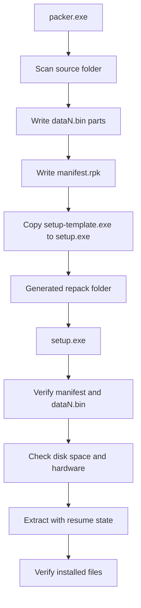

# RepackSuite Architecture

## Applications

- Developer Packer Application: scans source folders, builds archive parts, generates manifests, and creates `setup.exe`.
- End-User Installer Application: verifies nearby `.bin` files, validates system requirements, extracts files, resumes interrupted installs, and verifies output.

## Core Modules

- Compression Engine: profile configuration and codec interface for Store, Zstandard, LZMA2, SREP, and Precomp.
- Archive Manager: split `.bin` writer/reader with streaming IO.
- Integrity Manager: CRC and hash verification.
- Installer Generator: copies installer template and attaches theme metadata.
- Extraction Engine: resume-safe extraction through `.repack-resume`.
- Localization and Theme Engine: represented by sidecar metadata in this scaffold, ready for resource injection.

## Archive Format

Each part starts with a fixed 64-byte header:

```text
magic: RPKBIN1\n
headerSize
partIndex
payloadBytes
reserved
```

File payload bytes are concatenated across parts. The manifest maps each file to:

- relative path
- original size
- archive offset
- stored size
- CRC32
- 64-bit hash

## Runtime Flow



## Commercial UI Path

The current binaries are console-first for fast delivery. The code is intentionally split so a Qt 6 or WinUI 3 shell can bind to `RepackCore::IProgressSink` without changing archive logic.

Recommended UI layer:

- Qt 6 Quick/QML
- frameless dark window
- acrylic-like translucent panels
- animated stacked pages
- dashboard cards
- live CPU/RAM telemetry
- tray integration
- optional music through miniaudio

